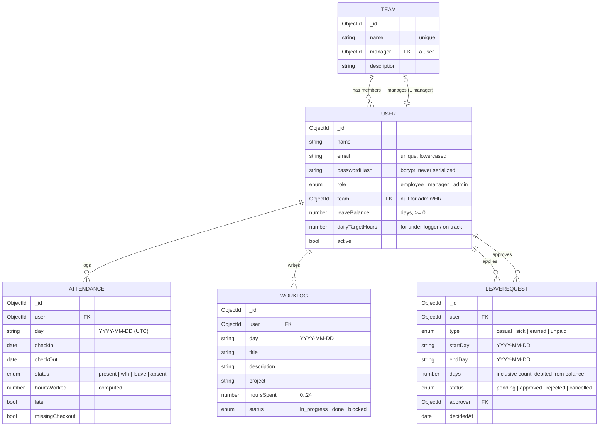

# Attendance & Work Tracker

A daily work & attendance tracker for real teams — check-in/out, daily work logs, a real
leave-approval workflow, and role-scoped dashboards for **employee · manager · admin/HR**.

Built with **Node/Express + MongoDB (Mongoose)** on the backend and **React (Vite)** on the
frontend. The emphasis is where the brief asks for it: a clean data model, **server-side**
role-based access control, and correct business logic (hours, late/missing-checkout, leave rules).

---

## Quick start (~5 minutes)

**Prerequisites:** Node 18+ and a running MongoDB (local `mongod` is fine — transactions are
optional, see [Leave concurrency](#leave-rules--concurrency)).

```bash
# 1. Backend
cd backend
cp .env.example .env          # defaults work for a local mongod on :27017
npm install
npm run seed                  # 3 teams, 10 users, ~2 weeks of data, sample leaves
npm start                     # API on http://localhost:4000

# 2. Frontend (new terminal)
cd frontend
npm install
npm run dev                   # app on http://localhost:5173 (proxies /api → :4000)
```

Open **http://localhost:5173** and log in. All seed users share the password **`Password123`**:

| Role             | Email             | Sees…                                  |
| ---------------- | ----------------- | -------------------------------------- |
| Admin / HR       | `admin@acme.test` | Everything, all teams                  |
| Manager (Eng)    | `maya@acme.test`  | The Engineering team only              |
| Manager (Design) | `dev@acme.test`   | The Design team only                   |
| Manager (Sales)  | `sam@acme.test`   | The Sales team only                    |
| Employee         | `eli@acme.test`   | Only their own data                    |

(Other employees: `nora@`, `raj@`, `pia@`, `theo@`, `cleo@` `acme.test`.)

**Run the tests** (hours calculation + leave-overlap rules):

```bash
cd backend && npm test
```

---

## Data model

Five collections. Relationships are modelled by `ObjectId` reference; a **user belongs to exactly
one team** (membership lives on the user side so it can never drift out of sync with a parallel
array on the team).



> An ER diagram image can be exported from this Mermaid block (or see `docs/` if you prefer a
> hand-drawn version). GitHub renders the diagram above inline.

### Why these choices

- **Day keys are stored as `"YYYY-MM-DD"` strings, not `Date`s.** Attendance, work logs and leave
  all reason about *calendar days*, not instants. String keys make range queries (`$gte`/`$lte`)
  and overlap checks trivial, sortable, and free of timezone drift. Actual **times**
  (`checkIn`/`checkOut`) stay full `Date` instants because we need them to compute hours.
- **One attendance row per user per day** is enforced by a **unique compound index
  `{ user, day }`** — this is what makes a second check-in impossible at the database level, not
  just in code.
- **Leave balance lives on the user** and is the single number debited on approval / restored on
  cancellation. The `days` count is frozen onto the request at creation so a later policy change
  can't retroactively change what was debited.
- **Membership on the user side** (`user.team`) keeps the relationship one-directional and
  consistent; "team members" is just `User.find({ team })`.

### Indexes

| Collection    | Index                                   | Serves                                      |
| ------------- | --------------------------------------- | ------------------------------------------- |
| users         | `email` unique, `role`, `team`          | login, scoping, team rollups                |
| attendance    | `{ user, day }` **unique**, `day`       | no double check-in; date-range reports      |
| work_logs     | `{ user, day desc }`, `{ day, project, status }` | scoped history; filtered reports     |
| leave_requests| `{ user, status }`, `{ user, startDay, endDay }` | pending queue; overlap checks       |

---

## Role-based access control (the core)

Access is **enforced on the server, in one place**, and the UI only *hides* what the server would
refuse anyway (defense in depth).

Every data query is built from one helper — [`utils/scope.js`](backend/src/utils/scope.js):

```
employee → { user: self }
manager  → { user: { $in: [...team members] } }
admin    → {}            // no restriction
```

- **List endpoints** (`/work-logs`, `/leave`, `/attendance`, dashboards) start their Mongo filter
  from `userScopeFilter(actor)`, so a manager's query is *physically incapable* of returning
  another team's rows.
- **Targeted reads** (`?user=<id>`) call `assertCanAccessUser(actor, id)` first → **403** if the
  target is outside the actor's scope. (Verified: an Engineering manager hitting a Design
  employee's logs gets `403`.)
- **Manager-only / admin-only routes** (`/leave/pending`, `/dashboard/team`, `POST /users`,
  `POST /teams`) are gated by `requireRole(...)` middleware → **403** for employees.
- **Writes** (`work-logs`, `attendance`) are **owner-only** via `assertCanWriteFor` (admins may
  act on anyone). A manager can *read* their team's logs but not edit them.
- The auth middleware **re-loads the user** from the DB on every request rather than trusting the
  JWT body, so a role change or deactivation takes effect immediately.

---

## Core logic & business rules

### Attendance — hours, late, missing check-out
[`utils/hours.js`](backend/src/utils/hours.js)

- **Hours worked** = `checkOut − checkIn`, rounded to 2 decimals.
- **Late** = check-in at/after a configurable threshold (`LATE_THRESHOLD_HOUR:MINUTE`, default
  09:30).
- **Missing check-out** is handled gracefully: if a user never checks out, the day is **capped at
  `STANDARD_DAY_HOURS`** (so a forgotten checkout can't inflate totals) and flagged
  `missingCheckout: true`. An admin route `POST /attendance/close-stale` reconciles past open days
  in bulk; the seed produces a few such days on purpose.
- A negative/garbage interval clamps to `0`; an absurd >24h interval caps to the standard day.

### Leave rules & concurrency
[`controllers/leaveController.js`](backend/src/controllers/leaveController.js)

On **apply**, all three rules are enforced:
1. **No past dates** — `startDay < today` → 400.
2. **No overlap** — a query for any `pending`/`approved` leave where
   `startDay ≤ newEnd AND endDay ≥ newStart` → 409 if found.
3. **No over-balance** — balance-bearing types (everything except `unpaid`) can't exceed the user's
   remaining balance → 400.

On **approve**, the balance is debited with a **conditional atomic update**
(`findOneAndUpdate({ leaveBalance: { $gte: days } }, { $inc: -days })`) so two concurrent approvals
can never push a balance negative. This runs inside a transaction **when the server supports them**
(replica set) and falls back to the same atomic update **without** a session on a standalone
`mongod` — so the app is correct on a cluster and still runs on a default local install
([`utils/tx.js`](backend/src/utils/tx.js)). Cancelling an approved leave **restores** the balance.
A manager cannot approve **their own** request.

### Reporting
[`controllers/dashboardController.js`](backend/src/controllers/dashboardController.js)

- **`GET /dashboard/me`** rolls a user's week (Mon–Sun) into days present, attendance hours, logged
  hours vs target, late count, task status breakdown, and an **on-track** flag.
- **`GET /dashboard/team`** (manager/admin) aggregates the scoped team: **present today**,
  **attendance %**, **pending approvals**, **team hours**, **under-loggers** (logged < 75% of
  target), and **blocked tasks** — plus a per-member table.

---

## API reference

All routes are under `/api`. All except `auth/*` require `Authorization: Bearer <jwt>`.

| Method & path                       | Role          | Purpose                                  |
| ----------------------------------- | ------------- | ---------------------------------------- |
| `POST /auth/signup`                 | public        | Self-register (role forced to employee)  |
| `POST /auth/login`                  | public        | Get a JWT                                |
| `GET  /auth/me`                     | any           | Current identity                         |
| `GET  /users` · `POST /users`       | any · admin   | Scoped user list · create user           |
| `GET  /teams` · `POST /teams`       | any · admin   | Teams · create team                      |
| `POST /attendance/check-in`         | any           | Start the day (blocks 2nd check-in)      |
| `POST /attendance/check-out`        | any           | Close the day, compute hours             |
| `GET  /attendance/today`            | any           | Today's record                           |
| `GET  /attendance?from&to&user`     | scoped        | Ranged history                           |
| `POST /attendance/close-stale`      | admin         | Reconcile forgotten check-outs           |
| `GET/POST/PATCH/DELETE /work-logs`  | scoped/owner  | CRUD + filter (`from,to,project,status,user`) + pagination (`page,limit`) |
| `POST /leave`                       | any           | Apply (overlap/balance/past-date rules)  |
| `GET  /leave?status&user&page`      | scoped        | List                                     |
| `GET  /leave/pending`               | manager/admin | Approval queue                           |
| `PATCH /leave/:id/decision`         | manager/admin | Approve / reject (+ balance debit)       |
| `PATCH /leave/:id/cancel`           | owner         | Cancel (+ balance restore)               |
| `GET  /dashboard/me?week&user`      | scoped        | Weekly personal summary                  |
| `GET  /dashboard/team?week`         | manager/admin | Team rollup                              |
| `GET  /dashboard/blocked`           | manager/admin | Blocked-task focus list                  |

**Status codes:** `200/201` success, `204` delete, `400` validation/rule violation (Zod or
business rule), `401` unauthenticated, `403` out of scope / wrong role, `404` not found, `409`
conflict (double check-in, overlapping leave, duplicate email).

---

## Decisions & trade-offs

- **MongoDB (with a clear model)** — the domain is naturally document-shaped (a person's day = one
  attendance doc + a few work logs), reads are mostly per-user/per-team ranges, and I get strong
  integrity guarantees where they matter via a **unique index** (no double check-in) and **atomic
  conditional updates** (no negative balance). I documented relationships and constraints above so
  the schema reads as clearly as a relational one would.
- **String day-keys over `Date`** — calendar-day reasoning is the 90% case; this removes a whole
  class of timezone bugs from overlap and range logic. Trade-off: per-day granularity (fine here).
- **Scope helper as the single source of truth** — one tested function builds every data filter, so
  RBAC can't be forgotten endpoint-by-endpoint. Trade-off: managers do one extra `User` lookup to
  resolve team members; cheap and cacheable if ever needed.
- **Transaction with graceful fallback** — correctness on a real cluster without forcing reviewers
  to set up a replica set locally.
- **Validation with Zod at the edge** — every body/query is parsed before a controller runs, so
  controllers deal only with well-formed input.

## Assumptions & what's intentionally left out

- A "working day" for leave/targets counts **calendar days** in the range (no holiday calendar) and
  the weekly target assumes a 5-day week — easy to extend with a holidays collection.
- Self-signup always creates an **employee**; promoting to manager/admin or assigning a team is an
  **admin** action (`POST /users`, `POST /teams`). No public way to self-assign a role.
- **Bonus items not built:** AI weekly-summary, CSV/PDF export, email notifications, charts, Docker,
  live deploy. The core (model, RBAC, logic, reporting) was the priority per the brief. Hooks for
  these exist (e.g. the weekly summary object is already computed server-side).

## Project layout

```
backend/
  src/
    models/        User, Team, Attendance, WorkLog, LeaveRequest
    middleware/    auth (JWT), rbac (roles), validate (Zod), error
    controllers/   auth, user, attendance, workLog, leave, dashboard
    routes/        one router per resource
    utils/         scope (RBAC core), hours, time, tx, token, validators
    seed/          seed.js
  test/            hours.test.js, leave.test.js   (node:test)
frontend/
  src/
    context/       AuthContext (JWT session)
    api/           fetch wrapper with token injection
    components/    Layout (role nav), ui (badges/stats)
    pages/         Login, Dashboard, Attendance, WorkLogs, Leave, Approvals, Team
```
